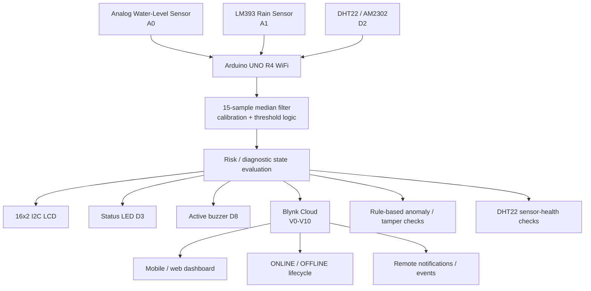

# System Architecture

FloodWatch is a localized IoT flood and weather monitoring prototype built around an **Arduino UNO R4 WiFi**. It combines environmental sensing, deterministic risk logic, local alerts, Blynk telemetry, and lightweight reliability/integrity checks.

## Processing priorities

The documented final design prioritizes diagnostic conditions so that a sensor fault or suspicious reading is not hidden behind an ordinary environmental label:

1. Sensor issue
2. Data tampering / anomaly
3. Critical flood
4. Medium flood
5. Low flood
6. Rain states
7. Safe

## Availability boundary

Complete-device availability is primarily visible through the **Blynk connection lifecycle**. If the device loses power or network connectivity, the cloud can mark it OFFLINE/System Down. This is separate from a DHT22-only sensor fault, which is represented through V6/V10 while the controller may remain online.
